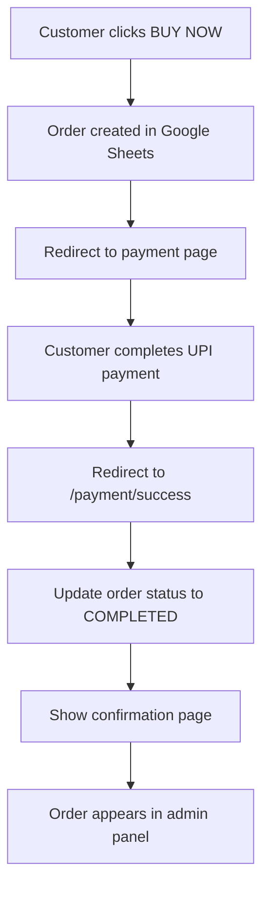

# 🛒 **Payment Tracking System Setup**

## 📋 **Google Sheets Structure Required**

### **Orders Sheet** (Create a new tab called "Orders")

Add these **exact column headers** in row 1:

| Column | Header               | Data Type | Description                            | Example                |
| ------ | -------------------- | --------- | -------------------------------------- | ---------------------- |
| A      | `order_id`           | Text      | Unique order identifier                | ORD1703425234567       |
| B      | `product_id`         | Text      | Product identifier from Products sheet | 1                      |
| C      | `product_name`       | Text      | Name of the product                    | Classic Black Umbrella |
| D      | `customer_name`      | Text      | Customer's full name                   | John Doe               |
| E      | `customer_email`     | Text      | Customer's email address               | john@example.com       |
| F      | `customer_phone`     | Text      | Customer's phone number                | +91 9876543210         |
| G      | `customer_address`   | Text      | Customer's shipping address            | 123 Main St, City      |
| H      | `quantity`           | Number    | Number of items ordered                | 1                      |
| I      | `unit_price`         | Number    | Price per item                         | 2500                   |
| J      | `total_amount`       | Number    | Total order amount                     | 2500                   |
| K      | `payment_method`     | Text      | Payment method used                    | UPI                    |
| L      | `payment_status`     | Text      | Payment completion status              | COMPLETED              |
| M      | `order_status`       | Text      | Order fulfillment status               | CONFIRMED              |
| N      | `upi_transaction_id` | Text      | UPI transaction reference              | TXN123456789           |
| O      | `created_at`         | DateTime  | Order creation timestamp               | 2024-12-24T10:30:00Z   |
| P      | `updated_at`         | DateTime  | Last update timestamp                  | 2024-12-24T10:30:00Z   |

## 🔄 **Payment Status Values**

- `PENDING` - Payment not yet completed
- `COMPLETED` - Payment successful
- `FAILED` - Payment failed
- `REFUNDED` - Payment refunded

## 📦 **Order Status Values**

- `PENDING` - Order created, awaiting payment
- `CONFIRMED` - Payment received, order confirmed
- `SHIPPED` - Order shipped to customer
- `DELIVERED` - Order delivered to customer
- `CANCELLED` - Order cancelled

## 🎯 **How Payment Tracking Works**

### **1. Order Creation**

When customer clicks "BUY NOW":

```javascript
// Creates order in Google Sheets with PENDING status
// Redirects to payment page with order ID
```

### **2. Payment Processing**

Customer completes UPI payment and is redirected to:

```
/payment/success?orderId=ORD123&transactionId=TXN456&amount=2500&productName=Umbrella
```

### **3. Payment Confirmation**

The success page automatically:

- Updates order status to `COMPLETED`
- Updates payment status to `CONFIRMED`
- Records UPI transaction ID
- Shows order confirmation

### **4. Order Management**

Admin can view and manage orders at:

```
/admin/orders
```

## 🛠 **Setup Instructions**

### **Step 1: Create Orders Sheet**

1. Open your Google Sheets document
2. Create a new tab called "Orders"
3. Add the exact column headers from the table above
4. Make sure the headers are in row 1, columns A-P

### **Step 2: Test Payment Flow**

1. Go to `/products` and select any product
2. Click "VIEW DETAILS"
3. Click "BUY NOW" - this creates an order
4. Complete the payment process
5. You'll be redirected to success page
6. Check the Orders sheet - your order should appear

### **Step 3: Monitor Orders**

1. Visit `/admin/orders` to see all orders
2. Filter by status (PENDING, CONFIRMED, etc.)
3. Update order status using dropdowns
4. View order details with "View Details" button

## 📧 **Payment Confirmation Flow**



## 🔍 **Tracking Payment Status**

### **Check Individual Order**

```javascript
// GET /api/orders?id=ORD123456789
fetch("/api/orders?id=ORD123456789")
  .then((res) => res.json())
  .then((data) => {
    console.log("Order status:", data.order.payment_status);
  });
```

### **Check All Orders**

```javascript
// GET /api/orders
fetch("/api/orders")
  .then((res) => res.json())
  .then((data) => {
    console.log("All orders:", data.orders);
  });
```

## 🚀 **Ready to Use!**

Once you've created the Orders sheet with the correct headers, your payment tracking system will be fully functional!

**Test it now:**

1. Create the Orders sheet tab
2. Add the column headers
3. Visit `/products` and make a test purchase
4. Check `/admin/orders` to see your order tracking in action!

---

**Need help?** The system includes error handling and fallbacks, so even if something goes wrong, you'll get helpful error messages to guide you through the setup.
